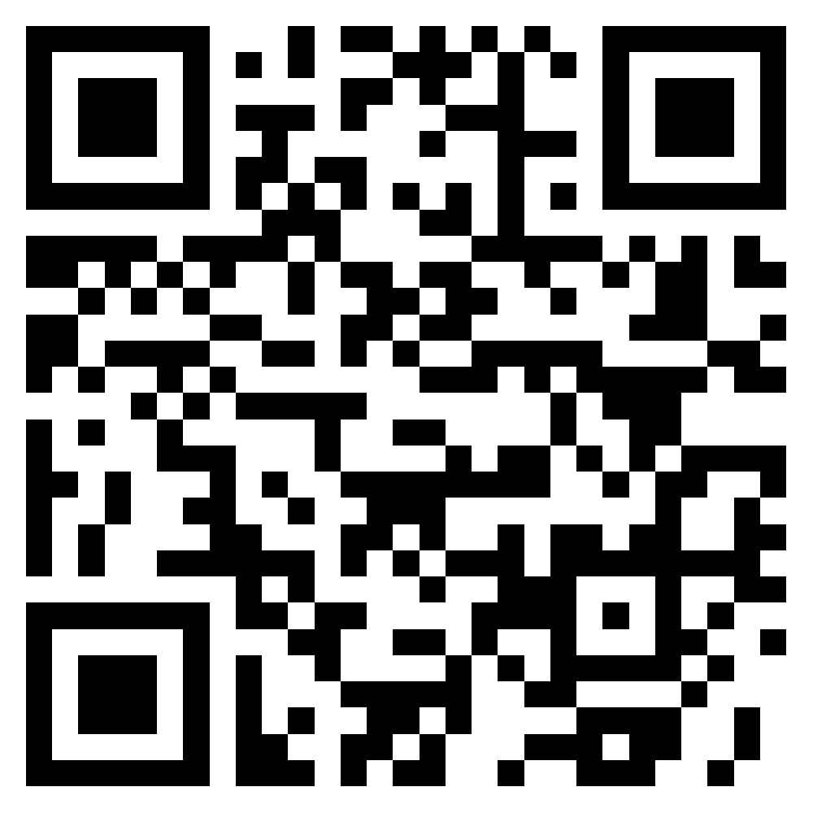

# EGID Project

We all know the benefit of technology, the power of it, and we in very fast world and every millisecond make a difference. Our goal is to help take the first step toward electronic government by building an a digital identity and signature system that provide confidentiality, authentication, integrity, and non-repudiation.

## How

- Change the national Id card with a new smart Id-card "EGID".

- EID-card will provide electronic identity operates on the basis of a public key infrastructure (PKI). All operations (authentication, signing, and decryption) will be PIN-protected (using PIN1, PIN2, PUK model).

- On top of this we can build an an efficient and secure electronic ecosystem that saves time and money. Lets get things done faster, easier and cheaper!

-- You can find more information about the project architecture and how it work [here](docs/architecture.md).

TODO:

- Complete client side
- Unit testing and improve stability
- Citizen Health History
- Certification Authority (CA)
- Timestamp Signature
- Government Stamp

We can imagine more to build on top of this for example.

- e-voting
- and more...

## Technology

- Back-End
  - C# 8
  - .NET Core 3.1
  - ASP.NET Core 3.1 / RESTFUL API
  - Entity Framework Core
  - SQL Server
- Front-End
  - HTML
  - CSS/Sass
  - TypeScript
  - Angular 9
  - Material UI

We are live on https://egid.xshaheen.com/

To test use this admin QR code:

  

