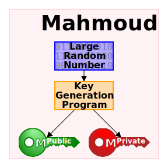
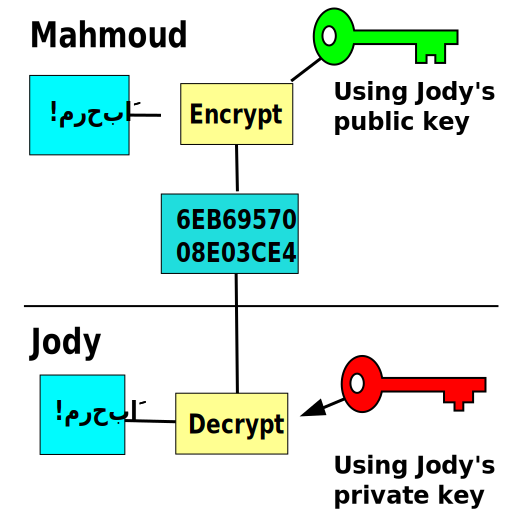
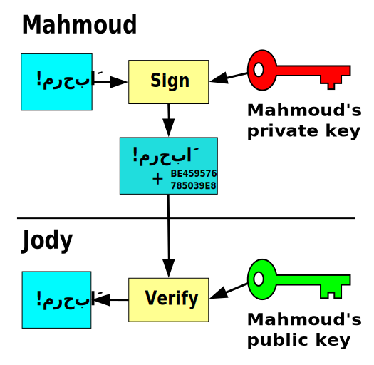

# Architecture

This document describe the architecture of application.

## Introduction

EGID project is designed to be easy to extend so it is build as collection of modules talk to each other. Which build on top of the core electronic identity system, which consist of

- **Identity System**

  Any person will electronically identified with his eID-card which is better and more secure than identification with a username and password in several ways.

  - **Decreasing the risk of users submitting false data for service providers**, which the data is received directly from the eID-card.
  - All service providers (which will build on top of this system) are able to directly and securely provide their services to all ID-card holders without prior registration.

  - This is also convenient for the users as they need not remember various user names and passwords – the same card and PIN are valid for all services.

- **Digital Signatures**

  Sign a document is done electrically. Using digital signatures is convenient and fast as it allows one to electronically and without using any paper perform the actions for which one previously had to give a signature on paper.

  - Digital signatures are also very secure as it **cannot be forged** and the correctness thereof is thereby ensured.
  - The validity of the certificate can be quickly and conveniently checked with the help of the validity verification service.

On top of these each service provider can build authorization system.

## Architecture of identity System (e-ID)

The core of the project is the identity system which based on [public key infrastructure (PKI)](https://en.wikipedia.org/wiki/Public_key_infrastructure).

---

But What is the PKI

Lets start by
**[Public-key cryptography](https://en.wikipedia.org/wiki/Public-key_cryptography)** which is a cryptographic system that uses pairs of keys: public keys which may be disseminated widely, and private keys which are known only to the owner (here we will embedded it in the card).

These to keys is asymmetric keys which means that these keys have a mathematical relation and can perform inverse operations.
The power of asymmetric cryptography comes from the fact it is _impossible for a private key to be determined from its corresponding public key._

- In this system, any person can encrypt a message using the receiver's public key, but that encrypted message **can only be decrypted** with the receiver's private key.

- Robust authentication ([digital signature](https://en.wikipedia.org/wiki/Digital_signature)) is also possible. A sender can combine a message with a private key to create a short digital signature on the message. Anyone with the sender's corresponding public key can combine the same message and the supposed digital signature associated with it to verify whether the signature was valid, i.e. made by the owner of the corresponding private key.
  This also _ensures that the message has not been tampered with_, as a signature is mathematically bound to the message it originally was made with, and verification will fail for practically any other message, no matter how similar to the original message.

> In this example the message is only digitally signed and not encrypted.
>
> 1. Mahmoud signs a message with his private key.
> 2. Jody can verify that Mahmoud sent the message and that the message has not been modified.

Now we have a digital seals and signatures that are equivalent to handwritten signatures and stamped seals. but properly implemented digital signatures are more difficult to forge than the handwritten type.

---

One important issue is confidence/proof that a particular public key is authentic, i.e. that it is correct and belongs to the person or entity claimed, and has not been tampered with or replaced by a malicious third party. Now it is the PKI turn.
One important issue is confidence/proof that a particular public key is authentic, i.e. that it is correct and belongs to the person or entity claimed, and has not been tampered with or replaced by a malicious third party.
